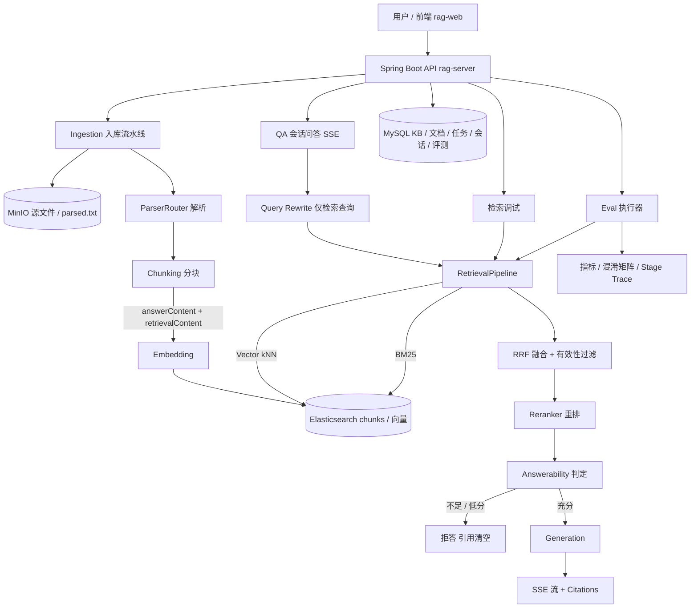

# GeneralRAG 架构总览

> Current-State 文档：描述当前代码的真实架构。接口契约见 `../contracts/openapi.yaml`；
> 启动方式见根 `../README.md`；当前指标的唯一来源是 `eval/FINAL-BASELINE.md`。
> 历史轮次记录见 `README.md`（本文档同级目录）的 Historical 分区。

## 1. 系统定位

GeneralRAG 是一个支持多格式文档入库、混合检索、重排、证据充分性判定、
历史感知 Query Rewrite、PDF 自动解析路由与完整离线评测体系的通用 RAG 系统。
单用户、多知识库、可本地运行；每个能力都可被离线评测复现与归因。

## 2. 总架构



四条业务链路共享同一条生产检索路径（`RetrievalPipeline`）：
QA 问答、检索调试（Debug）、离线评测（Eval）都不存在第二套检索实现。

## 3. 组件职责

| 组件 | 代码包 | 职责 |
| --- | --- | --- |
| API 层 | `com.rag.api` | KB/文档/会话/QA/调试/评测 REST 接口，全局异常与 requestId |
| 入库流水线 | `com.rag.ingestion` | 任务调度、解析、清洗、分块、向量化、索引；状态机持久化 |
| PDF 解析 | `com.rag.ingestion.parse` | pdfbox / mineru / auto（探针路由）三种互斥模式 |
| 分块 | `com.rag.ingestion.chunk` | LENGTH_OVERLAP / STRUCTURE 两种策略 + Excel 双层分块 + 检索表示增强 |
| 检索 | `com.rag.retrieval` | Query Rewrite、Vector+BM25、RRF、重排、上下文组装 |
| 判定 | `com.rag.answerability` | 低分直拒 + Evidence Sufficiency Judge，问答/调试/评测共用 |
| 生成 | `com.rag.llm` | SSE 流式问答、Prompt 组装、消息落库 |
| 评测 | `com.rag.eval` | 数据集版本化、运行执行、分块级锚点判定、指标与混淆矩阵 |
| 存储 | `com.rag.storage` | MySQL(JPA)、Elasticsearch(chunk 索引)、MinIO(对象存储) |

## 4. 数据组件

### MySQL（Flyway V1~V8）

| 域 | 内容 |
| --- | --- |
| 知识库 / 文档 | KB 元数据、文档元数据、多版本（root_id / version_no / is_active）、current_stage |
| 入库任务 | `ingestion_task`：stage、failure_stage、failure_reason、attempt（状态机持久化） |
| 会话 | `chat_session` / `chat_message`（SSE 问答历史与消息状态） |
| 评测 | 数据集 / 版本 / 条目（含 history 字段）、run / run_item（逐题 retrieved 快照、Judge 决策、refused） |
| 清理 | `cleanup_task`：删除补偿任务 |

### Elasticsearch（索引 `rag_chunk`）

每条 chunk 一个文档（`ChunkDoc`），关键字段：

| 字段 | 内容 | 用途 |
| --- | --- | --- |
| `content` | answerContent（忠实正文） | Judge / Generation / Citation / 证据锚点 |
| `retrieval_content` | answerContent + 确定性元数据前缀 | Embedding 输入（入库侧）、BM25 检索字段（查询侧）、重排输入 |
| `vector` | 1024 维向量（kNN） | 向量通道 |
| `title_path` / `page` / `seq` / `char_count` | 定位元数据（title_path 为 keyword，不参与检索） | 展示与评测锚点 |
| `knowledge_base_id` | term filter | 跨库隔离 |

旧 chunk 无 `retrieval_content` 时 BM25 回退 `content`（读侧兼容，重新入库后生效）。

### MinIO（bucket `ragsource`）

```
ragsource/{kbId}/{docId}/source.{ext}   原始上传文件（原样字节）
ragsource/{kbId}/{docId}/parsed.txt     解析 + 清洗产物（PARSING 完成的幂等标志）
```

删除按前缀批量执行（文档删 `/{kbId}/{docId}/`，KB 删 `/{kbId}/`），由 `CleanupService` 补偿。

## 5. 关键数据流

- **入库**：上传 → 任务表 QUEUED → PARSING → CLEANING → CHUNKING（产 answerContent/retrievalContent）→ EMBEDDING（输入 = retrievalContent）→ INDEXING → COMPLETED。详见 [INGESTION.md](INGESTION.md)。
- **问答**：question(+history) → Query Rewrite（仅检索查询）→ Vector+BM25 → RRF → 过滤 → Rerank → topK → Answerability 判定 → 通过则 Generation，否则拒答（引用清空）。详见 [RETRIEVAL-AND-QA.md](RETRIEVAL-AND-QA.md)。
- **评测**：数据集 → Eval Run（复用生产 QA 路径）→ 分块级锚点判定 + Stage Trace → 指标 / 混淆矩阵 / BadCase。详见 [EVALUATION.md](EVALUATION.md)。

## 6. 当前指标与当前演示

- 指标唯一来源：`eval/FINAL-BASELINE.md`（Feature Freeze 后的 canonical baseline，runId `0899d287`）。
- 演示唯一入口：`../demo/README.md`（Golden Demo，独立于评测数据集）。
- 范围冻结声明：`FEATURE-FREEZE.md`（Current Scope / Known Limitations / Future Work）。

## 7. 设计决策与演进

- 关键工程决策（含 tradeoff）：[ENGINEERING-DECISIONS.md](ENGINEERING-DECISIONS.md)
- Eval / BadCase 驱动的演进过程：[EVOLUTION.md](EVOLUTION.md)
