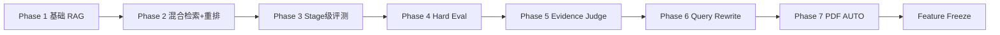

# GeneralRAG 演进史（Evolution）

> Current-State 文档：讲清这个系统如何通过 Eval / BadCase 一步步演进，而不是一次性搭出来的。
> 每阶段统一写法：Problem（观察到什么失败）→ Evidence（什么数据证明）→ Change（做了什么）→ Result（如何变化）→ Lesson。
> 当前数字唯一来源：[eval/FINAL-BASELINE.md](eval/FINAL-BASELINE.md)；历史轮次原始记录见 `README.md` 的 Historical 分区。

## Phase 1 — 基础 RAG（R1）

### Problem
从零建立"上传 → 解析 → 分块 → 向量检索 → SSE 问答"最小闭环；此时没有评测，能力无法声明。

### Evidence
第一版评测数据集用 `docName` 锚定，命中判定实际退化为文档级，Hit@K=1.00 是饱和的假满分——指标没有区分度。

### Change
交付最小可用系统（VECTOR 单通道）。

### Result
可运行、可演示；但"好不好"没有可信答案。

### Lesson
**先修指标再谈优化。** 指标失去区分度时，一切"满分"都是噪音。这是后续所有轮次的第 0 号约束。

## Phase 2 — 混合检索 + Rerank + 分块级评测口径（R2）

### Problem
纯向量检索对参数值/实体类问题的召回不稳定；同时评测口径必须先修好。

### Evidence
v2 数据集改用真实 chunkId/titlePath 锚定后，同一 KB 对照实测：VECTOR Hit@1=0.50 vs HYBRID_RERANK Hit@1=1.00（小规模调优集）。

### Change
- 检索收敛为单一 `RetrievalPipeline`（QA/Debug/Eval 共用），双通道 + RRF + DashScope 原生重排（失败显式降级）；
- 评测升级为分块级锚点判定（不回退 docName）；拒答引入双口径阈值。

### Result
混合检索在对照中显著优于单向量；调试服务从"复制检索语义"退化为薄封装。

### Lesson
评测与生产共用一条代码路径，否则测的永远是第二套实现；重排接口的外部依赖（非 OpenAI 兼容端点、分数请求相对、量纲不匹配）必须在需求期用真实调用验证。

## Phase 3 — Stage 级评测 + 双层内容 + 格式扩展（R3/R5）

### Problem
Hit 下降时无法归因：召回不足？融合排序问题？重排打回？另外 DOCX/XLSX/CSV 无法入库，Excel 表格问答完全失效。

### Evidence
早期逐题人工排查的成本；Excel 按长度切块后"表头与数据行"语义断裂。

### Change
- `RetrievalTrace`：生产路径顺带收集各阶段候选与名次，Stage 指标（Vector/BM25/RRF Recall@30、Rerank Recall@6、promoted/degraded）落地；
- `retrievalContent/answerContent` 双层分离（确定性增强仅供检索通道）；
- DOCX/XLSX/CSV 解析 + SpreadsheetChunker 双层分块（Sheet Summary + Row Group，行区间进 titlePath）；contentHash 证据锚点；文档多版本。

### Result
检索问题从"猜测"变成"读数"；Excel 问答获得行级定位能力（引用直接指到数据行区间）。

### Lesson
**可观测性先于优化。** 没有阶段级数据，后面所有"检索已经饱和"的判断都无从谈起。

## Phase 4 — Hard Eval（R6-A）

### Problem
调优集上指标好不等于系统可靠；需要带失败模式标签的高难数据集度量真实边界。

### Evidence
80 题评测集：61 正例 / 19 负例，负例标注 7 类 failureMode（OUT_OF_KB/PARTIAL_EVIDENCE/MISSING_CONDITION/ENTITY_MISMATCH/SCOPE_MISMATCH/NUMERIC_MISMATCH/UNSUPPORTED_INFERENCE）+ evidenceMode 三分（SINGLE/MULTI/FOLLOW_UP）。

### Change
Hard Eval 数据集 + 评测口径扩展（failureMode/evidenceMode breakdown、逐题 refused+decision 持久化）。

### Result
系统短板第一次被系统化呈现：部分负例以高分通过（错误回答）、FOLLOW_UP 组 Hit@1 仅约 0.5。

### Lesson
**能力工作必须自带评测材料**——没有 failureMode 标签，"拒答能力"只是一个模糊感觉。

## Phase 5 — Evidence Sufficiency Judge（R4/R4.1/R6-B）

### Problem
负例可以与正例检索分完全重叠：证据覆盖了主题但缺关键参数（PARTIAL_EVIDENCE）、
讲的是另一个实体（ENTITY_MISMATCH）、只能推出部分结论（UNSUPPORTED_INFERENCE）——
分数切不开，检索通道无解。

### Evidence
R4 Baseline：72 题专项集上 PARTIAL_EVIDENCE 与可答题的 rerank 分布完全重叠（两类都有 1.000）——
"高分直答"阈值在设计前就被数据否决。

### Change
两层门控：低分直拒（双口径阈值）→ 其余全部交给 LLM Evidence Judge（temperature=0）；
R4.1 稳定化（超时单一语义、bulkhead 并发闸门、Judge 与生成共用同一 Context 实例、
degraded 剔除出混淆矩阵）；R6-B Judge 硬化 + 生成语义对齐。

### Result
Final Baseline：Judge FAR 0.0588 / FRR 0.0164 / refusalAccuracy 0.9744（历史对照见
FINAL-BASELINE 的归因守卫——部分改善属 Judge variance，不作 retrieval 改进宣称）。

### Lesson
**相关 ≠ 充分，且 Judge 不是真值**（边界样本 conf≥0.95 仍会摇摆）；先跑 baseline 再造机制，门控形态必须来自数据。

## Phase 6 — History-aware Query Rewrite（R6-C）

### Problem
FOLLOW_UP 组（"前者是多少？""它默认开启吗？"）Hit@1 只有约 0.5，而 SINGLE/MULTI 检索已经很强——
根因不是 embedding，而是追问缺少实体。

### Evidence
Hard Eval evidenceMode breakdown：FOLLOW_UP Hit@1=0.5 vs SINGLE_CHUNK≈0.96；
Debug trace 显示改写前向量/BM25 双通道均召回失败。

### Change
`QueryRewriteService`：仅当 history 非空时把当前问题改写为独立可理解的检索查询；
只改检索查询，Judge/Generation 仍用原始问题 + history；失败回退原始问题。

### Result
Final Baseline FOLLOW_UP：Hit@1 = 1.0（4/4 触发且改写正确，rewrite invoked=4 / rewritten=4 / fallback=0）。

### Lesson
**Breakdown 维度定位根因**——聚合指标掩盖的组间差异正是瓶颈所在。

## Phase 6.1 — Effective query consistency（真实 bug 复盘）

### Problem
上线 rewrite 后发现：Vector/BM25 使用改写查询，Reranker 仍按原始问题打分——
一次检索里存在两个查询语义，FOLLOW_UP 证据在最后一步被重排打回。

### Evidence
R6-C 验证时的 FOLLOW_UP 检索异常；trace 中 preRerank 与 reranked 名次对不上召回通道的表现。

### Change
确立不变式：**一次检索执行只允许一个查询语义**。Embedding/BM25/Reranker 统一使用
effectiveRetrievalQuery（commit `c91f753`），回归测试锁定。

### Result
FOLLOW_UP 链路端到端一致；该不变式成为检索管线的显式约束（见 [RETRIEVAL-AND-QA.md](RETRIEVAL-AND-QA.md) §2）。

### Lesson
流水线各阶段共享隐式输入是正确性隐患；显式不变式 + 防漂移测试比"逐处记得改"可靠。

## Phase 7 — PDF AUTO Routing（R6-D）

### Problem
文本 PDF 用 PDFBox 快而稳，扫描件/复杂版面必须 MinerU OCR；全局单一解析器要么慢要么失败。
而且直觉的"先 PDFBox、失败换 MinerU"会让同一文件在不同环境产生不同 chunk 结构。

### Evidence
扫描 PDF（无文本层）经 PDFBox 抽出近乎空文本；普通文本 PDF 走 OCR 则纯属浪费分钟级延迟。

### Change
`pdf-parser=auto`：确定性质量探针（字符密度/空页率/可打印率/乱码率）→ 固定优先级路由规则；
**决策即所有权，AUTO ≠ fallback**（选 MINERU 后失败即 FAILED，不静默回退）；路由元数据持久化。

### Result
文本 PDF 零额外延迟，扫描件自动进 OCR；同一 PDF 路由结果永远一致（可复盘）。

### Lesson
Routing 与 Fallback 是两种语义：路由保证确定性所有权，fallback 牺牲复现性换可用性——文档解析场景必须选前者。

## Phase 8 — Feature Freeze

### Problem
Final Baseline 已达成：Hit@5=1.0、Rerank Recall@6=1.0、FOLLOW_UP Hit@1=1.0、
Vector/BM25/RRF Recall@30 全部 1.0。剩余错误集中在 Judge 边界摇摆（conf≥0.95 仍摇摆）
与生成侧软拒答（机制类问题只复述结论）——继续调 prompt 属于追逐模型方差。

### Evidence
`eval/FINAL-BASELINE.md`（runId 0899d287）：stage 指标全面饱和；badcase 归因中
retrieval 侧已无未解决问题，残差全部为 KNOWN_LIMITATION / MODEL_VARIANCE。

### Change
范围冻结（`FEATURE-FREEZE.md`）：新想法入 Future Work（AST/VLM/GraphRAG/Excel Agent），
参数/提示词/数据集冻结，只允许 correctness 级修复；冻结后执行最终评测，将当前系统真实表现
冻结为 canonical baseline。

### Result
一个"知道自己边界在哪"的 RC：每个残差都有编号、归因与状态。

### Lesson
**检索饱和之后，继续堆检索能力（AST/VLM/GraphRAG）没有证据支持**；
项目的价值在于"每个设计决策都被 Eval 证明过、每个失败都可复现归因"——
继续加功能只会稀释这条主线。
