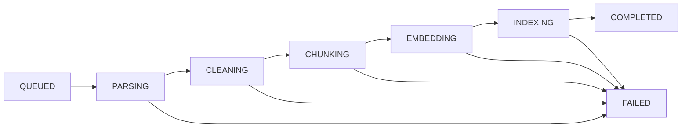
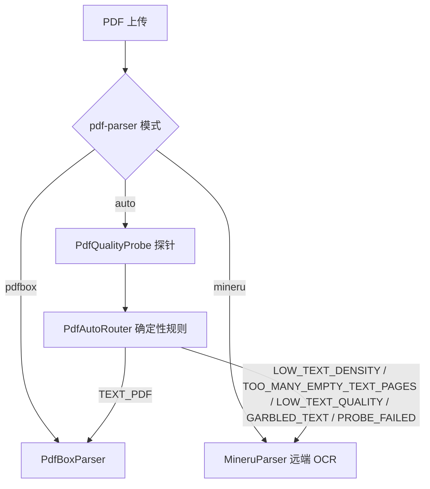

# GeneralRAG 入库（Ingestion）

> Current-State 文档：描述文件上传之后的真实处理过程。总览见 [ARCHITECTURE.md](ARCHITECTURE.md)。

## 1. 状态机

任务由 `IngestionTaskManager`（固定线程池，`rag.ingestion.worker-threads=2`）从 MySQL 任务表认领，
按契约 `PipelineStage` 枚举推进：



要点：

- **持久化**：每阶段开始前先落 `ingestion_task.stage`（`document.current_stage` 同步），
  失败记 `FAILED` + `failure_stage` + `failure_reason`（错误码 + 人读文案）。任何阶段失败即 FAILED，不存在跨阶段静默重试。
- **重启恢复**：`ApplicationReadyEvent` 把 QUEUED/RUNNING 任务复位 QUEUED（RUNNING 记 attempt+1）并重新入队；COMPLETED 为终态，FAILED 需显式重试。
- **阶段级幂等（续跑边界）**：重试时任务已被 API 层置回 QUEUED，`task.stage` 即 failureStage，续跑从该阶段开始：
  - PARSING 完成判据 = MinIO `parsed.txt` 存在 → 存在则 PARSING 跳过，CLEANING 一并跳过（清洗产物与解析文本一同落盘）；
  - CHUNKING 起直接重建（续跑时从 `parsed.txt` 重建输入）；ES 侧 `rebuildChunks` 先删后写，不产生重复分块；
  - 若解析产物尚未落盘时失败，重试会重新解析（解析+清洗重做）。
- **契约约束**：SSE 与任务进度不得出现枚举之外的"虚假进度"。

## 2. 支持格式与解析器

`ParserRouter` 按文件类型路由（一个类型一个解析器，重复注册启动即失败）：

| 格式 | 解析器 | 说明 |
| --- | --- | --- |
| PDF | `PdfBoxParser` / `MineruParser` / `AutoPdfParser` | 由 `rag.ingestion.pdf-parser` 三选一，互斥装配，见 §3 |
| MD | `MarkdownParser` | 保留标题层级供 STRUCTURE 分块 |
| TXT | `TextParser` | 纯文本直读 |
| DOCX | `DocxParser`（POI） | 段落 + 标题结构 |
| XLSX | `XlsxParser`（POI） | 交由 SpreadsheetChunker 双层分块 |
| CSV | `CsvParser` | 同上（STRUCTURE 策略） |

上传上限 `rag.ingestion.max-upload-size-mb=50`。

## 3. PDF 解析架构（R6-D）

配置项 `rag.ingestion.pdf-parser ∈ {pdfbox, mineru, auto}`，默认 `pdfbox`（最小启动不需要 MinerU）：



### AUTO 的路由规则（顺序固定，先命中先决）

| 顺序 | 规则 | 阈值（`rag.ingestion.pdf-auto`） | 决策 |
| --- | --- | --- | --- |
| 0 | 探针失败（加密/损坏件） | — | MINERU / PROBE_FAILED |
| 1 | 字符密度过低 | charCount < 100 或 charsPerPage < 30 | MINERU / LOW_TEXT_DENSITY |
| 2 | 空文本页占比过高 | emptyPageRatio > 0.8（单页判空阈值 20 有效字符） | MINERU / TOO_MANY_EMPTY_TEXT_PAGES |
| 3 | 可打印字符占比过低 | printableRatio < 0.90 | MINERU / LOW_TEXT_QUALITY |
| 4 | 替换字符（U+FFFD）过多 | replacementCharRatio > 0.05 | MINERU / GARBLED_TEXT |
| 5 | 其余 | — | PDFBOX / TEXT_PDF |

纯确定性规则，无 LLM 参与；同一 PDF 永远得到同一 routing reason。

### AUTO routing ≠ fallback

AUTO 选定 MINERU 后，MinerU 失败 → **FAILED**，不会退回 PDFBox 重试。
原因：回退意味着"同一文件、不同环境、不同 parser"——chunk 结构不可复现，文档版本、
评测锚点与调试记录都无法复盘。路由决策即解析器所有权，失败同样持久化路由元数据。

### parse_metadata（V8 迁移）

AUTO 模式下文档记录：`requested`（请求模式）/ `selected`（实际解析器）/ `routingReason`
（上表决策码）/ probe metrics（页数、字符数、空页率、可打印率、替换字符率）。
强制模式（pdfbox/mineru）同样记录 requested/selected，保证任何 PDF 都可回答"当年是谁解析的、为什么"。

## 4. Chunking 与双层内容（R5-A）

分块策略由知识库配置（`LENGTH_OVERLAP` 长度+重叠 / `STRUCTURE` 标题结构+超长封顶）；
XLSX/CSV 走 `SpreadsheetChunker` 双层分块（每 Sheet 一条 Summary 块 + Row Group 块，
行区间写入 titlePath，如 `... > 数据行 1-3`）。

每个 chunk 产生两种表示：

| 表示 | 生成 | 内容 | 用途 |
| --- | --- | --- | --- |
| **answerContent** | Chunker 直接产物 | 忠实原始 chunk 正文 | Judge 证据 / Generation 上下文 / Citation / EvidenceMatcher 锚点（contentHash） |
| **retrievalContent** | `RetrievalContentEnricher` | 确定性前缀（文档名 + 标题路径，titlePath 已含文档名时不重复）+ answerContent | Embedding 输入（入库）/ BM25 检索字段（查询）/ Reranker documents |

```text
retrievalContent 示例：
文档：部署手册.md
章节：部署手册 > 1. 概述 > 1.1 背景

（正文……）
```

### 为什么分离

检索通道希望"更多上下文"（文档归属、章节位置能显著提高 BM25/重排对
"文档说的是什么"类查询的命中），而生成与判定希望"忠实证据"——
如果直接把增强文本暴露给生成，metadata 可能被当作新的事实来源污染回答。
因此 `retrieval representation ≠ answer representation` 是本项目的核心设计之一：

- 增强只使用**确定性已有信息**，禁止 LLM contextual retrieval，无 titlePath 时不虚构；
- ES 查询侧 BM25 命中 `retrieval_content`（旧 chunk 无该字段时回退 `content`），
  kNN 向量的入库侧输入也是 retrievalContent；
- Judge / Generation / Citation / 评测证据匹配一律使用 `answerContent`。

> 存量数据兼容：`retrieval_content` 字段对重新入库的语料生效（见 FEATURE-FREEZE Known Limitations）。
