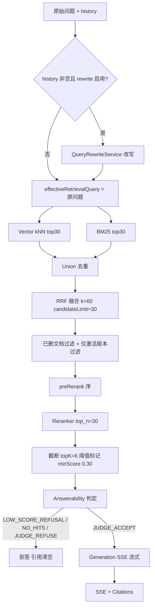

# GeneralRAG 检索与问答（Retrieval & QA）

> Current-State 文档：描述"用户问题如何变成答案"。总览见 [ARCHITECTURE.md](ARCHITECTURE.md)；
> 入库侧见 [INGESTION.md](INGESTION.md)。参数为当前冻结默认值（`rag-server/src/main/resources/application.yaml`），
> 基线表现见 [eval/FINAL-BASELINE.md](eval/FINAL-BASELINE.md)。

## 1. 问答主流程



所有数字来自当前配置：`mode=HYBRID_RERANK`、`topK=6`、`minScore=0.30`、`rrf.k=60`、
`candidate-limit=30`（Vector/BM25 各通道上限）、`max-context-chars=6000`。
阈值标记而非剔除——低于阈值的命中保留在结果中并标记 `passedThreshold=false`（调试页可见）。

## 2. Query Rewrite（R6-C）

```text
history + current question → QueryRewriter → effectiveRetrievalQuery
```

核心不变式（R6-C.1 修复后）：

- **effectiveRetrievalQuery** → Embedding 输入、BM25 查询、Reranker 打分。
  一次检索执行只允许一个查询语义，否则 rewrite 后出现"前序用改写查询召回、
  重排却按原始问题打分"的正确性 bug（FOLLOW_UP 证据被重排打回，实际发生过并已修复）。
- **original question + history** → Judge 与 Generation。
  改写查询不是用户实际提出的问题，绝不能覆盖原始语义与对话语境——rewrite 只属于检索 concern。

Rewriter 行为：

- 结构化输出 `{"rewritten": bool, "query": str[, "reason"]}`；`rewritten=false` 时 query 必须等于原问题（不等也回退原问题，不信任自由文本）。
- 系统指令禁止外部知识、算术、新过滤条件、语义扩张；只补历史中明确出现的指代（它/前者/该配置）。
- **失败即回退（fail-open to original）**：超时（5s，HTTP connect/read 单一超时语义）/模型异常/响应非法/改写为空 → 回退原始问题，QA 请求不失败；与 Judge degraded 是两个独立层。
- 可观测：rewrite 信息透传 RetrievalTrace（`queryRewritten`/`effectiveQuery`/latency），Debug 与 Eval 可见。

## 3. 为什么 Hybrid Retrieval（Vector + BM25）

| | Problem | Decision | Tradeoff |
| --- | --- | --- | --- |
| 纯向量 | 精确实体/参数值/错误码的召回不稳定（语义近似 ≠ 字面命中） | — | — |
| 纯 BM25 | 同义表达、口语化改写、跨语言场景不稳定 | — | — |
| **Hybrid** | — | 双通道并行召回，覆盖两类失败模式 | 计算成本更高；两路分数量纲不同，需要融合 |

## 4. 为什么 RRF（Reciprocal Rank Fusion）

- **Problem**：BM25 分与余弦相似度量纲完全不同，直接加权需要持续标定。
- **Decision**：应用侧 RRF，`score(d) = Σ 1/(k + rank)`，rank 从 1 起，k=60；再按 `2/(k+1)` 归一化到 (0,1]。
- **Why**：只利用 rank，天然免标定；并列时按首个通道位次 + chunkId 稳定排序（避免顺序抖动破坏两次运行可比性）。
- **Tradeoff**：忽略绝对分数信息。
- **部署注记**：ES basic license 无原生 RRF（付费特性），融合在应用侧实现——可单测、不依赖集群版本（设计内选择，非缺陷）。

## 5. 为什么 Reranker

召回阶段的目标是 Recall（宽进），重排阶段的目标是 Precision（精出）。
RRF 融合序只是两路 rank 的合并，不是语义相关度；Reranker 用交叉编码模型
对 (query, chunk) 逐一打分，把真正相关的证据顶到 topK。

Final RC baseline 的 stage 指标佐证（只引事实，不据此调参）：

- Vector/BM25/RRF Recall@30 = 1.0（召回饱和）
- Rerank Recall@6 = 1.0（重排后 topK 无证据丢失）
- Reranker Effect：promoted=17 / stable=47 / degraded=5，5 个降级块均未导致任何题的证据跌出 final topK

完整数字与归因见 [eval/FINAL-BASELINE.md](eval/FINAL-BASELINE.md)。

工程细节：

- DashScope **原生端点**（`/api/v1/services/rerank/text-rerank/text-rerank`），非 OpenAI 兼容路径（后者 404）。
- 失败即降级（degrade-on-failure=true）：非 2xx/超时/响应异常回退融合顺序并留痕标注，问答可用性优先。
- 单条候选正文截断 800 字符（按输入 token 计费）。
- 重排是否真正参与打分以"命中是否带重排位次"为准，而非看配置——未配置重排服务时装配恒等实现，若按重排口径套阈值会造成系统性误拒（must derive from evidence, not config）。

## 6. 有效性过滤

RRF 之后、重排之前依次过滤（`preRerank` 序在过滤之后记录，被过滤淘汰的 chunk
没有进重排器，rerank 升降级归因不得把它算成 degraded）：

1. **已删文档过滤**（KB-9）：ES 删除是补偿任务异步执行，主档删除即边界收口；
2. **仅激活版本**（R3-P3）：同名文档再上传产生新版本并自动激活，旧版本分块保留在 ES（可切回）但检索不再命中。

## 7. 两层拒答（Answerability，R4/R4.1）

| 层 | 机制 | 作用 |
| --- | --- | --- |
| **Layer 1 — 低分直拒** | 最高分 < 双口径阈值（重排生效用 `rerank-threshold=0.75`；降级/VECTOR 用 `cosine-threshold=0.30`） | 便宜、快速、零模型调用，过滤明显无关问题 |
| **Layer 2 — Evidence Sufficiency Judge** | 低分以外的全部问题交给 LLM Judge（temperature=0，timeout 15s，bulkhead 并发 4 / 等待 500ms） | 判断"仅凭这些证据能否完整回答"，不看相关性 |

判定枚举（`AnswerabilityDecisionType`）：`LOW_SCORE_REFUSAL`、`NO_HITS`、
`JUDGE_ACCEPT`、`JUDGE_REFUSE`、`JUDGE_DEGRADED`、`ANSWERABILITY_DISABLED`。
判定结果与 reason 如实透传到 SSE stage 事件 / Debug / Eval（不把 Judge 拒答谎报成低分）。

### 为什么不能只有相似度阈值

Hard Eval 的 Baseline 数据证明：PARTIAL_EVIDENCE、ENTITY_MISMATCH、UNSUPPORTED_INFERENCE
类问题检索分可以很高（专项集上与可答题的 rerank 分布完全重叠，两类都有 1.000），
不存在安全的"高分直答"阈值。证据覆盖了主题但缺关键参数、证据讲的是另一个实体、
证据只能推出部分结论——这些都需要 Judge 对证据本身做充分性判断，而不是对分数做切分。

门控形态与阈值校准依据：`docs/round4/01-Baseline分析.md`（数据依据）、
`eval/FINAL-BASELINE.md`（当前表现）。

### Judge ≠ Generation

设计边界：

```text
Judge      → Evidence sufficient?（证据是否足以回答）
Generation → How to answer?（如何组织回答）
```

两者共用同一模型（deepseek-v4-flash-0731 不同实例），判定正确 ≠ 生成行为正确。
Final Baseline 已观察到真实例证：seq54 Judge ACCEPT（conf 0.97）但生成侧对
"为什么"只复述结论不答原因，语义上部分拒答。因此 **Judge TP ≠ End-to-End QA Success**，
评测中两类指标严格分开（见 [EVALUATION.md](EVALUATION.md)）。

### Fail-open（failClosed=false）

Judge 失败（TIMEOUT / OVERLOADED / MODEL_ERROR / INVALID_RESPONSE）按当前配置
**fail-open**：退回旧阈值行为放行并显式标注 `JUDGE_DEGRADED`（failClosed=true 则保守拒答）。
Tradeoff：可用性更高，但 degraded 放行的题目有错误回答风险。
Final Baseline 真实例证：2 题 TIMEOUT（15s 超时）fail-open 放行，生成侧均做了
正确的证据边界表述、未产生事实性错误——但该两题按口径不进混淆矩阵（系统故障不是决策）。

### 输入一致性（R4.1）

Judge 与 Generation 看到的是**同一个 Context 实例**（assemble 一次、判定与 Prompt 各取所需），
不存在"Judge 前截断一次、生成前又一次"的两套证据；Judge 的 history 仅用于解析指代，不构成证据。

## 8. 生成与 SSE

- 生成仅依据检索证据（`max-context-chars=6000`），温度 0.2，`max-history-messages=8`；
- SSE 事件序列：`stage(RETRIEVAL_STARTED → RETRIEVAL_COMPLETED → ANSWERABILITY_CHECKED → GENERATION_STARTED)` → `delta` 流 → 终态；客户端必须容忍未知 stage 值；
- 拒答时回答文本说明原因且 **citations 为空数组**（不伪造引用）；回答时 citations 携带 chunkId/docName/titlePath/score；
- 会话消息落库（`chat_message`），支持多会话与追问（history 是 Rewrite/Judge 指代解析的输入）。
